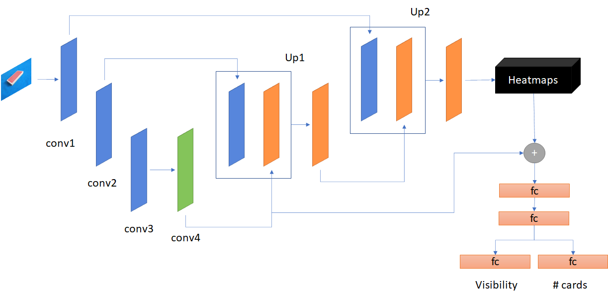
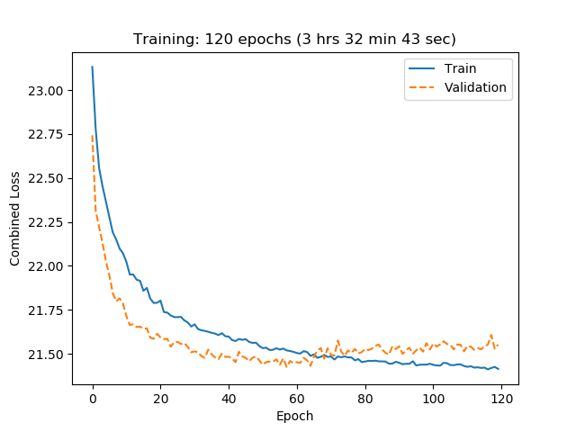

# Keypoint estimation and regression with PyTorch

## Introduction

My interest in **pose estimation** grew during the summer of 2020. Since I finished my master's degree, I've worked mostly on supervised image classification, and I wanted to expand my knowledge.

However, I didn't want to use famous datasets (MPII Human Pose, DensePose-COCO, PoseTrack...) because I don't have a powerful laptop. So I decided to create my own dataset related to one of my hobbies: magic!

I thought teaching an "AI" (I hate being so unspecific...) to **estimate the amount of cards in a packet** would be a nice side project. It may seem surprising to the reader, but [this](https://www.youtube.com/watch?v=nTxY9QUGXVE) is a common effect in card magic, with plenty of versions and authors.

## Dataset

I recorded around 52 videos of a pack with a different amount of cards (from 1 to 52). Then I subsampled the videos by one tenth and labelled the remaining frames.

There are eight keypoints:

- Upper left (face) corner
- Upper right (face) corner
- Upper left (back) corner
- Upper right (back) corner
- Lower left (face) corner
- Lower right (face) corner
- Lower left (back) corner
- Lower right (back) corner

The keypoint locations are used to generate the heatmaps, which consist of *small 2D-Gaussians*. The coordinates of the peak values in each Gaussian/heatmap correspond to each keypoint location. This is very useful because it **makes the ground truth less sparse**.

## Model

I decided to use an oversimplified UNet with some tweaks.

- The main path of the model generates *eight heatmaps*, one for each keypoint. 
- In order to predict the amount of cards of the packet, I decided to combine the output of the downsampling part with the eight heatmaps (after some pooling to reduce the size of the maps).
    - To prevent backprop from doing weird things, I first *detach* these masks from the computation graph and then concatenate them with the encodings from the downsampling part (green block).
- I finally predict the amount of cards (normalised, i.e. 0 to 1) and classify each keypoint as visible/not visible from the heatmaps. This is used to decide which keypoint is shown in the final output.

This is what the model looks like:

## Loss functions and metrics

- Heatmaps: I use channel-wise MSE and compare the predicted maps to the ground truth.
- Number of cards: I also use MSE.
- Keypoint detection: BCE should do the work. In the end this part is a binary classification (visible/not visible).

The **overall loss function** (**L**) is:
$$
L = MSE(heatmap) + MSE(cards) + BCE(detection)
$$
The **metric** (**M**) is based on the number of cards predicted:
$$
M = MSE(cards)
$$

## Results

This is what I get after 120 epochs (ugh, there is a bit of over-fitting):

This is an example of the output of the current model with the validation set:

With a *mean card error* (**M**) of 4 cards. Not bad for a simple model!

## Future work

- I should definitely move onto more powerful yet small models. Maybe MobileNet?
- Getting more data is a must.
- Why am I still doing this?

## References

These are the readings where I got the inspiration from:

[1] [Joint Training of a Convolutional Network and a Graphical Model for Human Pose Estimation](https://arxiv.org/abs/1406.2984)

[2] [Stacked Hourglass Networks for Human Pose Estimation](https://arxiv.org/abs/1603.06937)

[3] [Pose Estimation Guide](https://www.fritz.ai/pose-estimation/)

[4] [Human Pose Estimation With Stacked Hourglass Networks and Tensorflow](https://towardsdatascience.com/human-pose-estimation-with-stacked-hourglass-network-and-tensorflow-c4e9f84fd3ce)

[5] [U-Net: Convolutional Networks for Biomedical Image Segmentation](https://arxiv.org/abs/1505.04597)